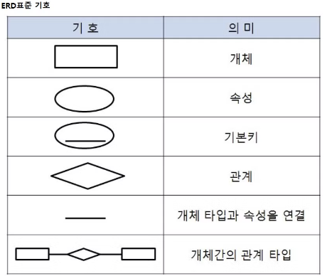
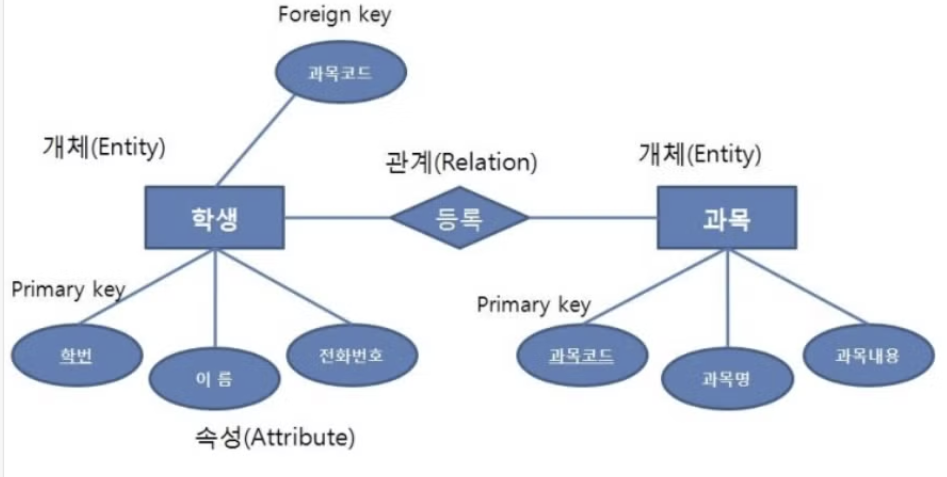

# 외래키

외래키는 두 개의 테이블을 연결해주는 연결 다리 역할을 한다.

외래키의 이점은 아래와 같다.

1. 데이터 무결성 유지
2. 데이터 일관성 유지
3. 관계 정의

하지만 외래키에 의해 참조되는 테이블에서 데이터의 수정이나 삭제가 발생하면, 참조하고 있는 테이블의 데이터도 같이 영향을 받을 수 있다.

# 기본키

SQL 데이터베이스에서 특정 레코드를 식별할 때 기준이 되는 반드시 필요한 키이다.

기본키는 다음 아래와 같은 조건을 따른다.

1. 값의 변동이 잦은 키는 기본키로 부적절하다.
2. NULL값을 가질 수 있는 속성이 포함된 키는 부적절하다.
3. 단순한 키를 기본키로 선택한다.
4. 하나의 테이블에는 반드시 하나의 기본키만 존재한다.

## 기본키 생성 방법

<pre>
<code>
CREATE TABLE users(
  id INT PRIMARY KEY,
  name VARCHAR(50),
  email VARCHAR(100),
  password VARCHAR(50)
)
</code>
</pre>

# ER 다이어그램

ERD(Entity-Relation Diagram: 개체 관계도)은 데이터베이스 설계를 시각적으로 표현한 다이어그램이다.

위 이미지와 같은 ERD 표준 기호를 사용하여 데이터베이스 구조를 시각적으로 표현한다.

ERD의 예시는 위 그림과 같다.

# 복합 키

기본키는 한 테이블에 한 개만 존재할 수 있다. 하지만 꼭 한 테이블에 한 컬럼만 기본키로 지정할 수 있는 것은 아니다.

두 개 이상의 컬럼을 묶어서 하나의 기본키로 지정하는 것을 복합키라고 한다.

# 연관관계

1. 1:1 관계 : 개체 집합 A의 각 원소가 개체 집합 B의 원소 1개와 대응
2. 1:N 관계 : 개체 집합 A의 각 원소는 개체 집합 B의 원소 여러 개와 대응할 수 있고, 개체 집합 B의 각 원소는 개체 집합 A의 원소 1개와 대응
3. N:M관계: 개체 집합 A의 각 원소는 개체 집합 B의 원소 여러개와 대응할 수 있고, 개체 집합 B의 각 원소는 개체 집합 A의 원소 여러 개와 대응한다.

# 정규화

정규화는 데이터의 일관성,정규화는 데이터의 일관성, 최소한의 데이터 중복, 최소한의 데이터 유연성을 위한 방법이며 데이터를 분해하는 과정이다.
정규화를 하면 불필요한 데이터를 입력하지 않아도 되기 때문에 중복 데이터가 제거 된다.

정규화의 장점

- 데이터베이스 변경 시 이상 현상을 제거할 수 있다.

- 정규화된 데이터베이스 구조에서는 새로운 데이터 형의 추가로 인한 확장 시, 그 구조를 변경하지 않아도 되거나 일부만 변경해도 된다.

정규화의 단점

- 릴레이션 분해로 인해 릴레이션 간의 JOIN연산이 많아진다.

- 질의에 대한 응답 시간이 느려질 수도 있다.

- 만약 조인이 많이 발생하여 성능 저하가 나타나면 반정규화를 적용할 수도 있다.

정규화는 여러 단계로 나누어진다.

가져야한다.

1. 제 1정규화(1NF) -테이블의 각 열이 원자값을 가져야한다. 즉, 한 열에 여러 개의 값이 들어갈 수 없고, 모든 데이터는 분리된 값을 가져아한다.
2. 제 2정규화(2NF)- 제 1정규화를 만족하고 , 기본 키에 종속되지 않은 부분적 종속이 없어야 한다.
3. 제3정규화(3NF) - 제 2정규화를 만족하고, 기본 키에 직접적으로 종속되지 않은 속성이 없어야 한다.
4. BCNF ( Boyce-Codd 정규화) -제 3정규화를 만족하면서, 모든 결정자가 후보 키여야 한다.

# 반정규화

데이터베이스의 성능 향상을 위하여 ,데이터 중복을 허용하고 조인을 줄이는 데이터베이스 성능 향상 방법이다.

반정규화는 조회(select)속도를 향상시키지만, 데이터 모델의 유연성은 낮아진다.

반정규화는 다음 아래와 같은 이유로 수행한다.

1. 정규화에 충실하여 종속서으활용성은 향상 되었지만 수행속도가 느려진 경우
2. 다량의 범위를 자주 처리해야하는 경우
3. 특정 범위의 데이터만 자주 처리하는 경우
4. 요약/집계 정보가 자주 요구되는 경

[반정규화 절차]

대상 조사 및 검토 → 데이터 처리 범위 , 통계성 등을 확인해서 반정규화 대상을 조사한다.

다른 방법 검토 → 반정규화를 수행하기 전에 다른 방법이 있는지 검토한다.

반정규화 수행 → 테이블,속성,관계 등을 반정규화 한다.

[반정규화 기법]

계산된 컬럼 추가 → 배치 프로그램으로 총 판매액 ,평균잔고, 계좌평가를 미리 계산하고 그 결과를 특정 칼럼에 추가한다.

테이블 수직 분할→ 하나의 테이블의 두 개 이상의 테이블로 분할한다. 즉 , 칼럼을 분할하여 새로운 테이블을 만드는 것이다.

테이블 수평분할→ 하나의 테이블에 있는 값을 기준으로 테이블을 분할하는 방법이다.
