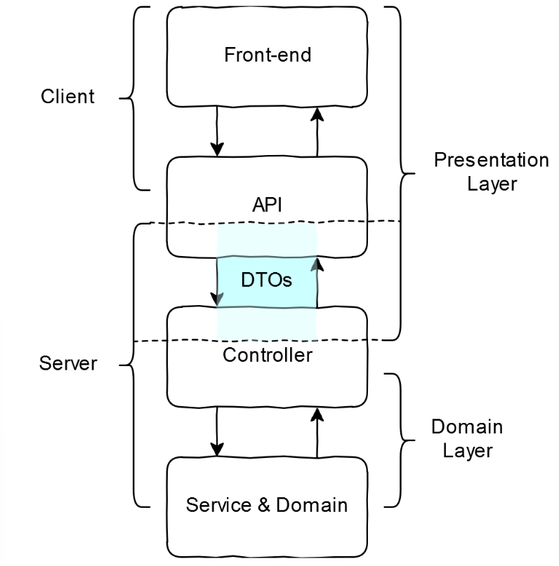

# ES

**ES**는 **ECMAScript**의 약자이다.

ECMA 인터내셔널의 ECMA-262 기술 규격에 정의된 표준화된 스크립트 프로그래밍 언어이다. 자바스크립트를 표준화하기 위해서 만들어졌다.

즉, ES는 프로그래밍 언어가 아닌 스크립트 언어들에 대한 표준, 규격이다.

# ES6

## ES6의 주요 변화 및 특징

- **Promises (프로미스)**

  - 비동기 코드를 작성하는 방법이다. 예를 들어, API에서 데이터를 가져오거나 실행에 시간이 걸리는 함수를 처리할 때 사용할 수 있다.
  - 프로미스는 특정 작업이 완료되면 그에 맞춰 작동하는 약속을 의미한다.
  - 비동기 작업이나 약속된 작업의 성공 및 실패 여부를 표준화된 방식으로 처리할 수 있도록 해주는 것이 Promise의 의의이다.

- **화살표 함수**

  - 함수 표현식을 화살표 함수로 표현할 수 있다. 화살표 함수는 코드를 간결하게 만들어 가독성과 유지보수성을 높인다.
  - `this`를 바운딩하지 않고 그대로 가져온다.

- **const와 let**
  - `const`는 변수 선언을 위한 ES6의 새로운 키워드로, `var`보다 강력하며 선언된 변수는 재할당할 수 없다.

## ES6를 중요시하는 이유

ES6는 ES5 이하 명세에서 발생했던 여러 문제들을 해결했으며, 가독성과 유지보수성을 향상시키는 다양한 기능들이 추가되었다. 이에 따라 **React**와 **Vue** 같은 유명 라이브러리들이 ES6 기반으로 개발 환경을 변경했고, 현재 많은 라이브러리들도 ES6을 권장하고 있기 때문에 중요하다.

# ES Module

- ES Module이란 ES6에 도입된 모듈 시스템이다. import , export를 사용해 분리된 자바 스크립트 파일끼리 서로 접근할 수 있다.

  모듈화는 다음과 같은 장점이 있다.

  - import -export의 명시적 관계로, 하나의 모듈이 제거되면 어떤 모듈이 손상되었는지 알 수 있다. 의존성 파악에 용이하다.
  - 코드들을 각각 독립적으로 작동할 수 있는 단위로 나누기 수월하다. 이는 모듈 재사용을 통해서 다양한 종류의 어플리케이션을 만들 수 있다.
  - import -export로 관계되지 않은 모듈간의 오염은 일어나지 않는다.

# 프로젝트 아키텍처

## 프로젝트 아키텍처가 중요한 이유

아키텍처는 시스템의 구조를 정의하며 컴포넌트 간의 상호작용 방식을 결정하기에 매우 중요하다. 잘 설계된 아키텍처는 유지보수가 쉽고, 확장성이 높으며 , 시스템의 성능을 최적화 할 수 있다.

## Service-Oriented Architecture

    가능한 오퍼레이션의 집합을 만들고, 각 오퍼레이션에 있는 어플리케이션의 대응하는 서비스 레이어 를 사용하여 어플리케이션의 경계를 정의하는 패턴이다.

    Service 계층 - 다른이름으로는 비즈니스 로직 계층이라고 하고 , 아키텍처의 가장 핵심적인 비즈니스 로직을 수행하고 클라이언트가 원하는 요구사항을 구현하는 계층이다.

## MVC패턴

Model - View -Controller로 구성되어 있다.

View: 화면의 구성(렌더링)을 담당

model: 상태(state)를 다룬다.

Controller: View와 Model 사이의 인터페이스 역할

```javascript
class Component {
  _target;
  _model;
  _view;

  constructor(target, model, view) {
    this._target = () => document.querySelector(target);
    this._model = model;
    this._view = view;
  }
}

class Model {
  _state;

  constructor(initialState) {
    this._state = initialState;
  }
}

class View {
  _target;

  constructor(target) {
    this._target = () => document.querySelector(target);
  }
}

// 생성 시
const component = new Component("#app", new Model({}), new View("#app"));
```

## 그 외 다른 프로젝트 구조

- MVVM : 주로 Augular와 같은 프레임 워크에서 많이 사용
- FLUX
- MVP

# 비주니스 로직

비즈니스 로직이란 홈페이지 회원가입을 예로 들 수 있다.

중복 아이디가 있는지 없는지 검사하기위한 일련의 과정과 단순히 가동된 데이터를 표시해주는 과정으로 나뉘는데 , 데이터 가공을 담당하는 중복아이디 있는지 없는지 검사하는 영역을 비즈니스 로직이라고 한다.

- 프로그래머는 유저가 원하는 행위를 컴퓨터에게 잘 전달하기 위해서 비즈니스 로직을 잘 구상해야한다.

# DTO

- DTO란 Data Transfer Object로 데이터 전송 객체이고 , 프로세스 간에 데이터를 전달하는 객체를 의미한다.

말 그대로 데이터를 전송하기 위해 사용하는 객체이기에 그 안에 비즈니스 로직같은 복잡한 코드는 없고 순수하게 전달하고 싶은 데이터만 담겨있다.


