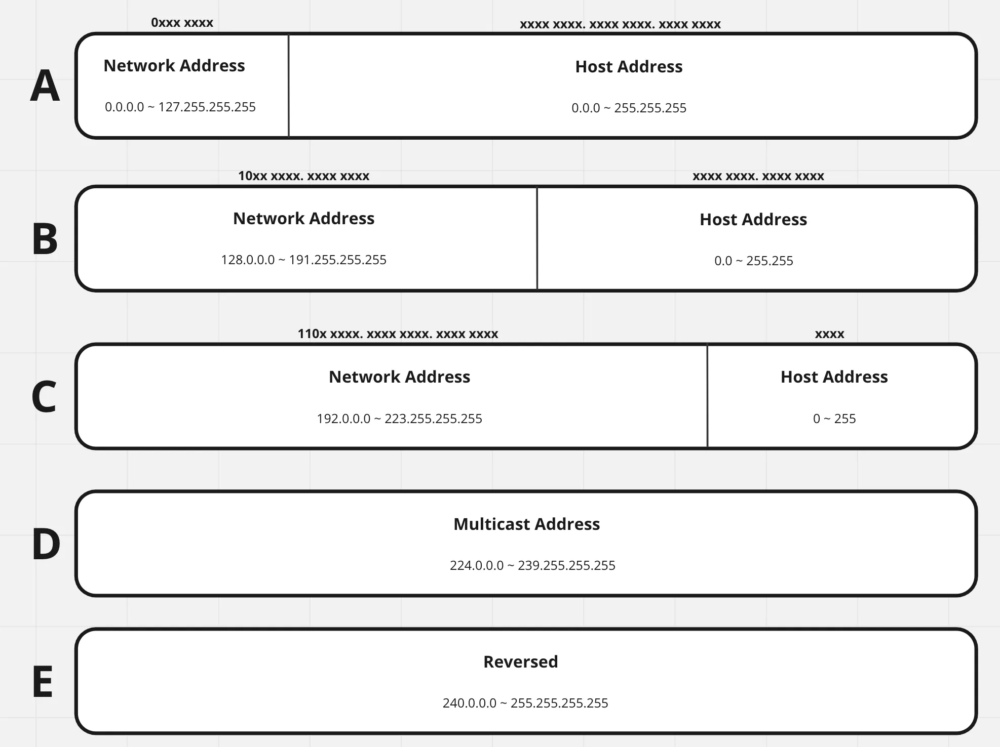
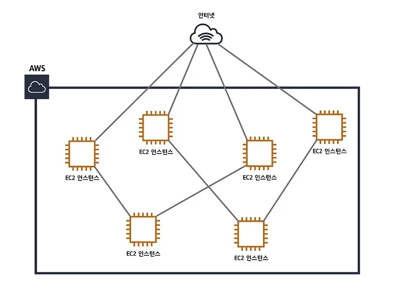
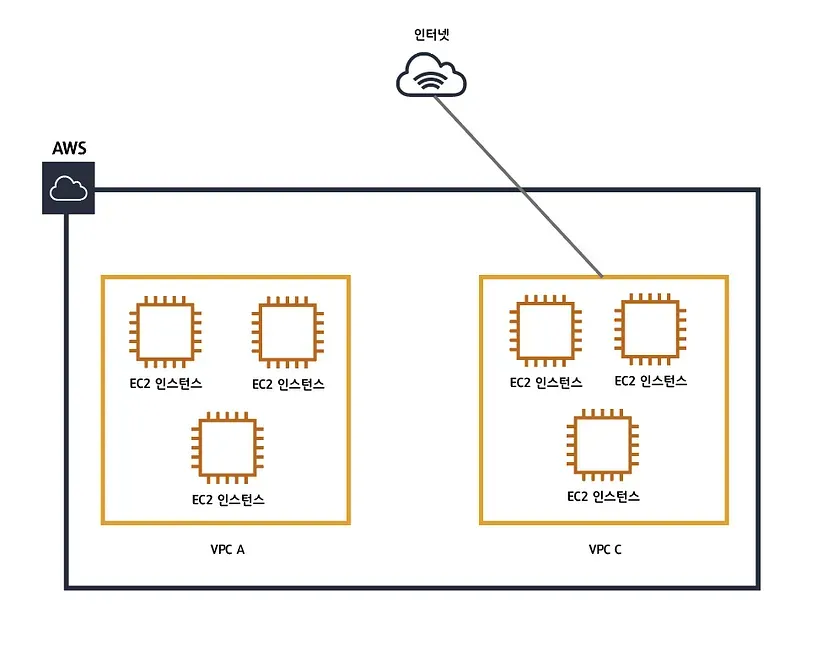

# AWS

Amazon Web Services는 Amazon에서 제공하는 클라우드 서비스로, 네트워킹을 기반으로 가상 컴퓨터와 스토리지, 네트워크 인프라 등 다양한 서비스를 제공하고 있다.

## 클라우드 컴퓨팅 ?

- 기존의 물리적 형태의 실물 컴퓨팅 리소스를 네트워크 기반 서비스 형태로 제공
- **IaaS**, **PaaS**, **SaaS** 세 가지로 나뉜다.
- **AWS는 IaaS**이다.

---

## 리전과 가용영역

AWS에서 제공되는 클라우드 컴퓨팅 리소스들은 미국에서만 호스팅 되지 않고 전세계 각국에서 호스팅이 이루어진다. 이때 이 호스팅되는 위치를 지리적 관점으로 영역을 구분하는데, 이를 **리전(Region)**이라고 한다.

- **한국에서 호스팅되는 영역**: **서울 리전**
- 전 세계적으로 물리적으로 호스팅 영역을 구분해 놓았기에, AWS 사용자는 **서비스될 국가와 가장 가까운 리전**을 선택하여 **빠른 속도**를 낼 수 있다.

### 가용영역 (Availability Zone)

- AWS의 리전은 **가용영역**이라는 더 작은 단위로 분리할 수 있다.
- **AWS 리전**은 **최소 2개 이상의 가용영역**으로 구성된다.

# 서브네팅

서브넷팅이란 **IP 주소 낭비를 방지**하기 위하여 네트워크를 분할하여 효율적으로 사용하는 개념이다.

IPv4 주소(32bit)의 고갈이 현실화되며 이 문제를 해결하기 위해서 **서브넷팅**이라는 개념이 등장했다.

## IP 주소 클래스

IP 주소는 크게 **5개의 클래스**로 나누어진다.

### **Class A**

- **IP 범위**: 1.0.0.0 ~ 126.0.0.0 _(127은 규정상 제외)_
- **호스트 개수**: \( 2^{24} - 2 \)

---

### **Class B**

- **IP 범위**: 128.0.0.0 ~ 191.255.255.255
- **네트워크 개수**: \( 2^{14} \)
- **호스트 개수**: \( 2^{16} - 2 \)

---

### **Class C**

- **IP 범위**: 192.0.0.0 ~ 223.255.255.255
- **네트워크 개수**: \( 2^{21} \)
- **호스트 개수**: \( 2^{8} - 2 \)  
   _(호스트 영역에서 네트워크 주소와 브로드캐스트 주소는 사용할 수 없기에 호스트 개수에 -2를 해준다)_

---

## 네트워크 주소와 브로드캐스트 주소

- **네트워크 주소**  
   일반적으로 하나의 네트워크를 통칭하기 위해 사용하는 주소, **해당 네트워크의 첫 번째 IP 주소**.

- **브로드캐스트 주소**  
   네트워크에 있는 모든 호스트에게 한 번에 데이터를 전송하는 데 사용되는 주소, **해당 네트워크의 마지막 IP 주소**.

# 라우팅

라우팅은 **네트워크에서 경로를 선택하는 프로세스**이다. 컴퓨터 네트워크는 **노드**라고 하는 여러 시스템과 이러한 노드를 연결하는 **경로** 또는 **링크**로 구성되었다. 상호 연결된 네트워크에서 **두 노드 간의 통신**은 여러 경로를 통해 이루어질 수 있다.

라우팅은 네트워크의 **통신 효율성**을 높인다.

- 네트워크가 최대한 **정체 없이** 최대한 많은 용량을 사용할 수 있도록 **데이터 트래픽을 관리**함으로써, **네트워크 장애를 최소화**해준다.

---

# VPC (Virtual Private Cloud)

VPC는 **격리된 가상 네트워크**를 정의하고 제어할 수 있는 기능을 제공하여 **퍼블릭 클라우드**에 **프라이빗하고 안전한 공간**을 생성할 수 있도록 해준다.

---

### VPC가 없는 구조

VPC가 없다면, **EC2 인스턴스**들은 서로 **거미줄처럼 연결**되고 인터넷과 연결된다.  
이로 인해 **복잡도가 엄청나게 상승**하기 때문에 VPC를 사용한다.

### VPC 있는 구조

VPC를 적용하면 위 그림과 같이 VPC별로 네트워크 구성이 가능하고 각각의 VPC에 따라 다르게 네트워크 설정을 줄 수 있다.

각각의 VPC는 완전히 독립된 네트워크처럼 작동한다.

VPC에서 사용하는 사설 아이피 대역은 아래와같다.

- 10.0.0.0 ~ 10.255.255.255(10/8 prefix)
- 172.16.0.0 ~ 172.31.255.255(182.16/12 prefix)
- 192.168.0.0 ~ 192.168.255.255(192.168/16 prefix)

한번 설정된 아이피대역은 수정 불가하고, 각 VPC는 하나의 리전에 종속된다. 각각의 VPC는 완전히 독립적이기에 만약 VPC간 통신을 원한다면 VPC 피어링 서비스를 고려해야한다.

# 사설 IP 주소

공인 IP와 사설 IP는 **컴퓨터 네트워크에서 사용되는 두 가지 주소 체계**이다.

각각의 IP 주소는 **컴퓨터나 장치를 인식**하고 **네트워크에서 통신**하기 위해 사용된다.

---

## 공인 IP (Public IP)

- 공인 IP는 **인터넷 서비스 제공자(ISP)**에 의해 할당되며 **전역 인터넷에서 사용**된다.
- 공인 IP는 인터넷을 통해 **전 세계적으로 공개**되며 **고유한 식별자** 역할을 한다.
- 공인 IP를 사용하면 **인터넷 상에서 다른 장치나 네트워크에서 접근**할 수 있다.
- **IPv4**에서는 **32비트**, **IPv6**에서는 **128비트**로 표현된다.

---

## 사설 IP (Private IP)

- 사설 IP 주소는 **집이나 사무실 내부의 로컬 네트워크**에서 사용되며, **인터넷에 직접 연결되지 않는다**.
- 사설 IP는 **로컬 네트워크 내에서만 유효**하며, 인터넷에서는 **라우터를 통해 공인 IP로 변환**되어야 통신할 수 있다.
- **사설 IP 주소 대역**:
  - `10.0.0.0 ~ 10.255.255.255`
  - `172.16.0.0 ~ 172.31.255.255`
  - `192.168.0.0 ~ 192.168.255.255`

---

공인 IP는 **고유**하며 인터넷 상에서 접근이 가능하지만, 사설 IP는 **로컬 네트워크**에서만 유효하며 인터넷에서 직접 접근할 수 없다.

---

# 포트 포워딩

포트 포워딩은 **외부 IP:포트 번호**와 **내부 IP:포트 번호**를 **연결**해주는 기능이다.

- 별도의 설정 없이 **외부 IP가 접속**을 시도하면 **내부의 어떤 프로세스** 또는 **기기와 연결할 지 알 수 없어 접근이 불가능**하다.
- **포트 포워딩**을 통해 **외부 IP:특정 포트**로 접속하면, **내부 IP:특정 포트**로 맵핑해준다.

---

# NAT 프로토콜

**NAT (Network Address Translation)**은 **IP 패킷**에 있는 **출발지 및 목적지 IP 주소**와 **포트 번호**를 변경하면서 네트워크 트래픽을 주고 받게 하는 기술이다.

---

## NAT를 사용하는 이유

1. **IP 주소 절약**
2. **보안 강화**

---

## 동작 원리

1. **패킷 헤더**에 출발지와 목적지의 주소를 기록한다.
   - 출발지: 사설망 IP 주소.
2. **기본 게이트웨이**에서 외부로 나가는 패킷을 인식하면, 출발지 IP 주소를 **게이트웨이의 공인 IP 주소**로 변경한다.
   - 이때, 별도의 **NAT 테이블**을 보관한다.
3. **웹 서버**에서 응답을 보내면, 패킷의 목적지 IP는 **게이트웨이 공인 IP 주소**가 된다.
4. 게이트웨이는 **NAT 테이블**을 참조하여 패킷의 최종 목적지 IP를 **사설망 IP 주소**로 변경하고, 호스트에 전달한다.

---

# 포트 번호

**포트 번호**란 **TCP/IP** 네트워크에서 데이터를 수신하는 **프로세스를 구분**하기 위한 번호이다.

- **1~2계층**: MAC 주소
- **3계층**: IP 주소
- **4계층**: 포트 번호를 사용해 데이터를 받을 프로세스를 구분한다.

---

## 포트 번호 특징

- 포트 번호는 **16비트**로 이루어짐.
- **2^16**이므로 **65536개의 번호**가 존재 가능.
- 포트 번호는 **구역마다 나누어 관리**된다.

---

## 잘 알려진 포트 번호

- **FTP**: 21
- **SSH**: 22
- **SMTP**: 25
- **DNS**: 53
- **HTTP**: 80
- **HTTPS**: 443
