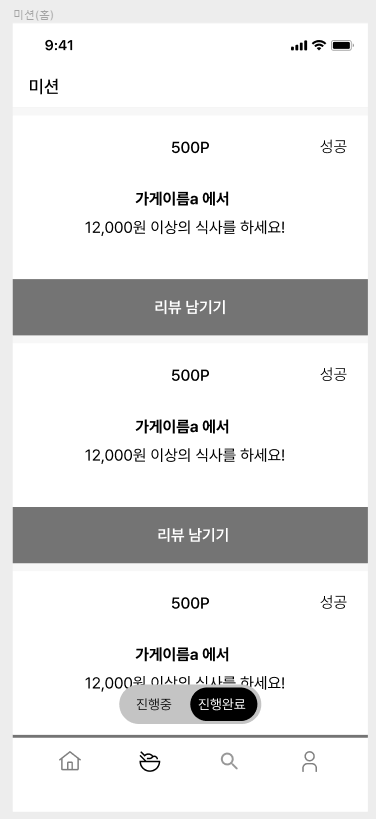

```sql
SELECT m.contents, m.point, m.status, s.name
FROM missions AS m
JOIN stores AS s ON m.store_id = s.id
JOIN user_mission AS um ON um.mission_id = m.id
WHERE um.user_id = my_id AND m.status = 1 AND m.id > cur_m.id # 실패 0, 진행중 1, 완료 2
ORDER BY m.id
LIMIT 10
```


```sql
INSERT INTO (score, content, user_id, store_id) VALUES (5,'내용', my_user_id, store_id)

#가게 사장님 리뷰 확인하기
SELECT reviews.*, users.name FROM reviews
JOIN users ON users.id = reviews.user_id
WHERE reviews.store_id = my_store_id
AND reviews.created_at < cur_created_at
ORDER BY reviews.created_at
LIMIT 10;
```


```sql
SELECT m.*, s.name, fc.name, m.expiration_date - now() AS remain_day
FROM missions AS m
JOIN stores AS s ON m.store_id = s.id JOIN food_categories AS fc ON fc.id = s.category_id
WHERE s.location_id IN (SELECT l.id FROM locations AS l
												WHERE l.name = '안암동')
AND m.id NOT IN (SELECT um.mission_id FROM user_mission AS um
								 WHERE um.user_id = my_user_id)
AND m.id > cur_mission_id
ORDER BY m.id
LIMIT 15
```


```sql
# 마이페이지 화면에 나올 데이터
SELECT user.name, user.e_mail, user.phone_no, user.point
FROM user
WHERE user.id = my_user_id

# 작성한 리뷰 눌렀을 때 나오는 데이터
SELECT reviews.* FROM reviews
WHERE reviews.user_id = my_user_id
AND reviews.id < cur_review_id
ORDER BY review.id DESC
LIMIT 10
```